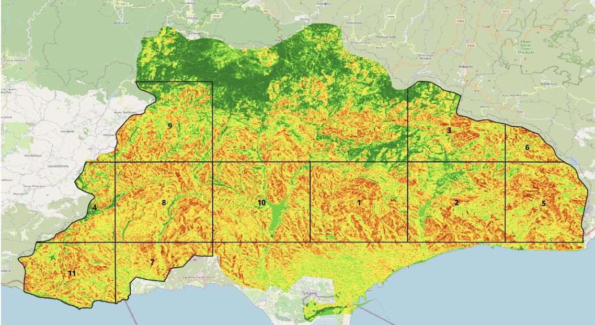
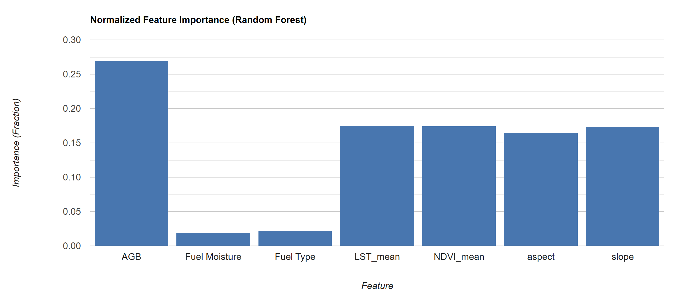

# Forest Fire Susceptibility Mapping using Google Earth Engine

Probability-based wildfire predictive susceptibility model for Limassol (Cyprus),
built in Google Earth Engine using Sentinel-1/2, Landsat 8/9, SRTM and a
Random Forest classifier. Study period: 2019-2024 (April-November).

## Results

### Susceptibility map

### Feature importance

## Model performance
| Metric | Value |
|---|---|
| Accuracy | 0.73 |
| Kappa | 0.63 |

## Predictors used
| Variable | Source |
|---|---|
| Land use / land cover | Dynamic World, ESA WorldCover |
| NDVI, NBR | Sentinel-2 |
| Fuel moisture (LFMC proxy) | Sentinel-1 + Sentinel-2 |
| Land surface temperature | Landsat 8/9 |
| Slope, Aspect | SRTM 30 m |

Fire labels come from NASA FIRMS (confidence 60 or higher).

## Method
1. Build predictor layers in GEE
2. Sample fire and no-fire pixels (balanced)
3. Split 70% training and 30% testing
4. Train a Random Forest (400 trees)
5. Predict probability and classify into 5 risk classes

## How to run
1. Open the script in GEE: [https://code.earthengine.google.com/7e40a8bd7fe5f76acc07fb2fd1efd7ed)]
2. Define your study area as `studyRegion`
3. Click **Run**

## Limitations
- FIRMS fire data is about 1 km resolution
- Random train/test split may overestimate accuracy
- Fuel moisture is a proxy index, not measured field data

## License
MIT
